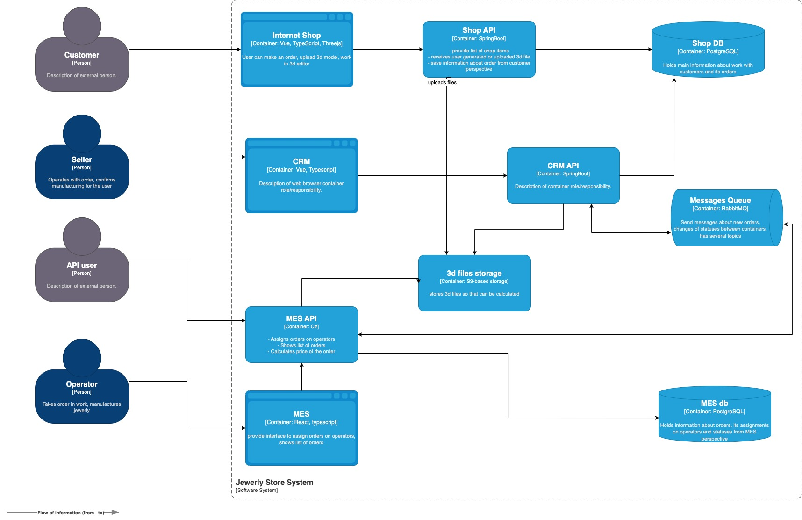

# Анализ системы компании и C4-диаграммы

- Для взаимодействия с фронтом CRM и MES приложений, а также API настроить мониторинг запросов по методу RED, для
  выявления проблем взаимодействия.
- Для сервисов CRM и MES приложений и БД - настроить метод USE, для выявления нагрузки и задержек процессов.
- Добавить логирование на основные события, обработку очереди сообщений MQ, смену статусов заказов, для выявления
  нарушений в процессах заказов.

# Мотивация

1. На данный момент данные Яндекс Метрики не дают полной картины, в следствии чего бизнесу не известны причины
   возникающих проблем.
2. Ведение мониторинга позволяет видеть этапы процессов, быстрее реагировать на проблемы.
3. Сокращение времени на решение проблем, позволит удержать клиентов.
4. Определение критичных точек позволит разработать решения для предотвращения инцидентов.

# Выбор подхода к мониторингу

1. Внедрение методов RED для пользовательских запросов подразумевает следующие показатели:
    - Requests Rate — частота запросов, которые обслуживает сервис в секунду.
    - Errors — количество неудачных запросов в секунду. Ошибки напрямую влияют на взаимодействие с потребителями.
      Следовательно, отслеживать частоту ошибок просто необходимо.
    - Duration — количество времени, которое уходит на выполнение одного запроса.

2. Метод USE для сервисов приложений и БД дает следующие показатели:
    - Utilization (утилизация) — это среднее время, которое ресурс занят работой. Измеряется в процентах.
    - Saturation (насыщенность) — объём работы, которую ресурс не может выполнить и вынужден откладывать (например, в
      очередь), чтобы сохранять работоспособность. Насыщенность можно измерить как длину очереди.
    - Errors (ошибки) — Количество ошибок при обработке запросов.

3. Логирование событий процессов необходимо разделить на уровни:
    - FATAL — отказ сервиса или оборудования.
    - ERROR — ошибочное состояние. Например, «Пользователь заблокирован».
    - WARN — состояние, которое близко к нестандартному поведению системы. Например, «Пользователь неправильно ввёл
      пароль».
    - INFO — это штатное поведение. Такие логи обычно используют для записи обычных сообщений. Например, «Данные
      загружены».
    - DEBUG обычно используют для отладки. На продакшн-серверах их не используют, чтобы не засорять логи лишней
      информацией.
    - TRACE обычно используют в среде разработки и для отладки в тестовом окружении.

   Уровень критичности логов настраивает разработчик системы. Логи легко добавить, но главное — не перестараться: они
   занимают место. Важно определить, сколько логов какого типа вы будете хранить и в каком виде.

# Метрики

| Метрики                                            | инстанс              | описание                                     | ярлыки              | 
|----------------------------------------------------|----------------------|----------------------------------------------|---------------------|
| Number of requests (RPS) for internet              | shop/CRM/MES API     | количество запросов/ответов на приложение    | status, endpoint    | 
| Response time (latency)                            |                      |                                              | endpoint            | 
| Number of requests (RPS) per user for internet     |                      | количество запросов/ответов на пользователя  | endpoint, user_type | 
| Number of simultanious sessions                    |                      | количество одновременных сессий              | endpoint            | 
| Number of HTTP 200                                 |                      | количество неявных ошибок запросов           | service, endpoint   | 
| Number of HTTP 500                                 |                      | количество явные ошибок запросов             | service, endpoint   | 
| Kb tranferred (received)                           |                      | объем загруженных данных                     | endpoint, user_type | 
| Kb provided (sent)                                 |                      | объем выгруженных данных                     | endpoint, user_type | 
|                                                    |                      |                                              |                     | 
| CPU %                                              | shop/CRM/MES сервисы | Нагрузка процессора сервера                  | instance            | 
| Memory Utilisation                                 |                      | Использование памяти сервера                 | instance            | 
| Number of dead-letter-exchange letters in RabbitMQ |                      | количество потерянных сообщений MQ           | queue_name          | 
| Number of message in flight in RabbitMQ            |                      | количество сообщений в процессе отправки MQ  | queue_name          | 
|                                                    |                      |                                              |                     | 
| Memory Utilisation                                 | shop/MES БД          | размер используемой памяти БД                | db_name             | 
| Number of connections                              |                      | количество подключений БД                    | db_name             | 
| Size of instance                                   |                      | размер дискового пространства занимаемого БД | db_name             | 
|                                                    |                      |                                              |                     | 
| Size of S3 storage                                 | файловое хранилище   | размер дискового пространства занимаемого    |                     | 

# План действий

- развернуть Prometheus + Grafana (в облаке)
- интегрировать экспортеры метрик в Shop API, CRM API, MES API
- настроить экспорт метрик RabbitMQ через rabbitmq_prometheus plugin
- настроить дашборды по каждому сервису и общую панель "здоровье заказов"

# показатели насыщенности

| показатель                   | пороговое значение            | действия                      | 
|------------------------------|-------------------------------|-------------------------------| 
| БД макс подключений          | 80%                           | алерт + авто-масштабирование  | 
| CRM/MES API CPU              | 70%                           | алерт + ручной анализ         | 
| CRM/MES API memory           | 80%                           | алерт + ручной анализ         | 
| MES API CPU > 70% или memory | 80% >>> алерт + ручной анализ |                               | 
| RabbitMQ очередь             | 100 сообщений                 | алерт + проверка потребителей | 

- алерт - сообщение на почту ответственных и уведомление через бот-мессенджеров
- ручной анализ - заведение тикетов в Jira

