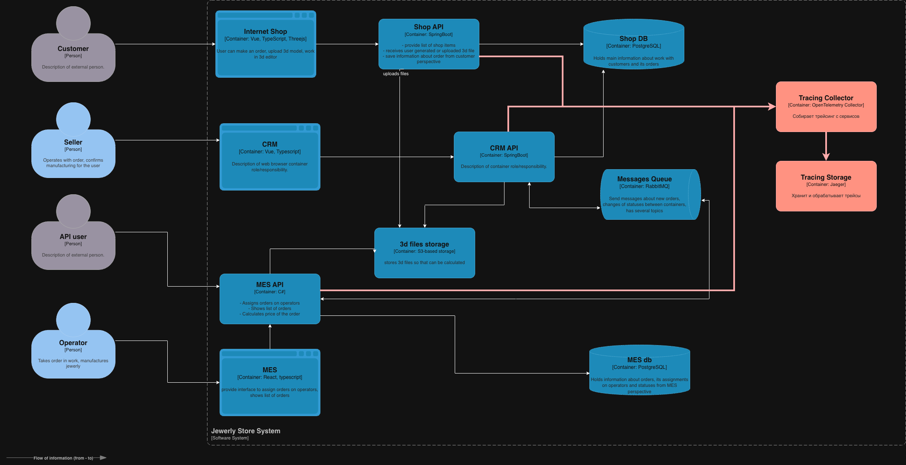
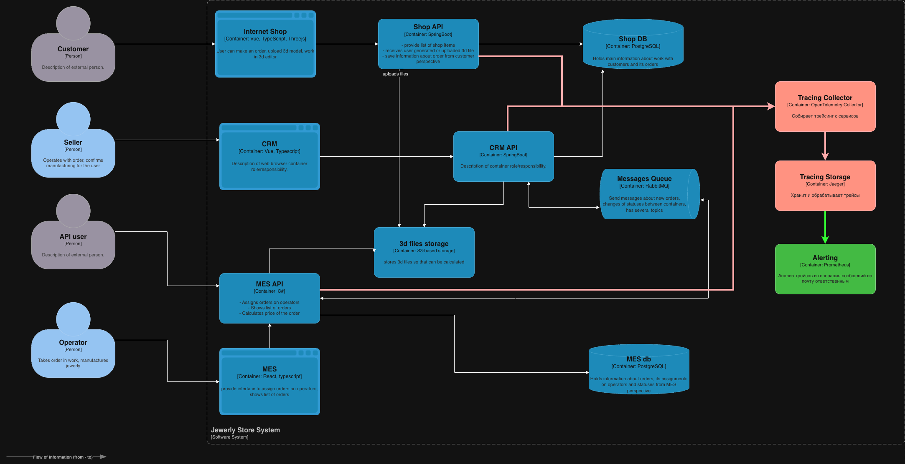
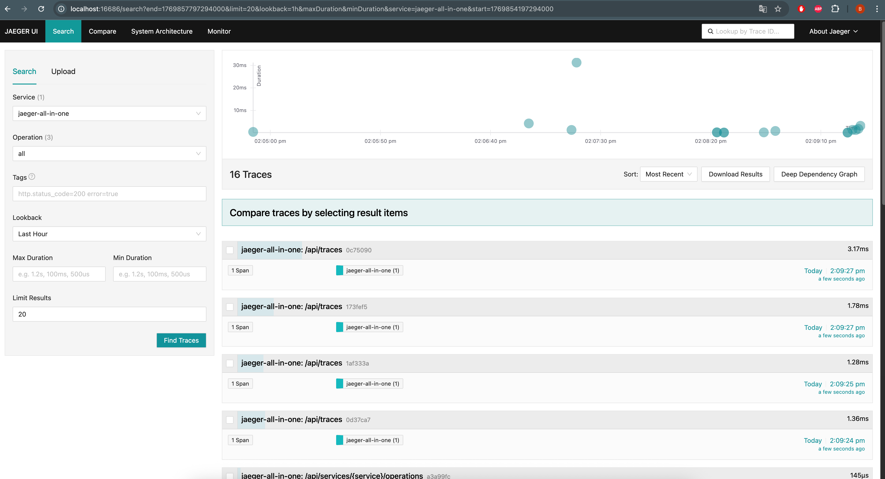

# Анализ системы компании в контексте планирования трейсинга.

По заявленным статусам заказа, проследим цепочку от клиента к оператору:

| Ключевые точки заказа | описание                                                                       | статус                 | места, где заказ может «сломаться» или зависнуть |
|-----------------------|--------------------------------------------------------------------------------|------------------------|--------------------------------------------------|
| онлайн-магазин        | пользователь загрузил файл с 3D-моделью или создал его с помощью конструктора. | FILE_UPLOADED          | наличие файла в S3                               |
| онлайн-магазин        | пользователь загрузил файл с 3D-моделью или создал его с помощью конструктора. | FILE_UPLOADED          | связь с id заказа                                |
| MES                   | система посчитала стоимость заказа.                                            | PRICE_CALCULATED       | время обработки может достигать 30 минут         |
| CRM                   | заказ подтверждён, его можно отдавать в производство.                          | MANUFACTURING_APPROVED | потеря сообщений MQ                              |
| CRM                   | заказ подтверждён, его можно отдавать в производство.                          | MANUFACTURING_APPROVED | операторы пропустили заказ                       |
| MES                   | оператор взял заказ в работу.                                                  | MANUFACTURING_STARTED  | зависание интерфейса                             |
| MES                   | оператор взял заказ в работу.                                                  | MANUFACTURING_STARTED  | ошибки фильтрации списка                         |
| MES                   | оператор взял заказ в работу.                                                  | MANUFACTURING_STARTED  | конфликты назначения заказов                     |

## список данных для трейсинга

- id загруженного файла
- id заказа
- id инстанса
- id пользователя
- id оператора
- размер файла
- статус заказа
- время событий
- ошибки

# Мотивация

- Создавать логи на все места дорого: получится очень много информации, а хранилище стоит денег.
- Трейсинг позволяет проследить цепочку вызовов.
- Трейсинг помогает быстро находить причины, например, медленной работы сервиса.
- У трейсинга как средства устранения неполадок есть дополнительные преимущества, поскольку любое исключение или ошибка
  обычно фиксируется вместе со всем контекстом запроса.

# Предлагаемое решение

- sdk OTel (OpenTelemetry) - добавить в Api сервисы shop/MES/CRM для формировния и отправки сигналов.
- данные отправляются в Jaeger через OpenTelemetry Collector.
- У Jaeger есть хранилище, где эти данные записываются.
- Jaeger-UI — веб-интерфейс для поиска и просмотров трейсов.

Добавляем трейсинг:

[jewerly_c4_model.drawio](jewerly_c4_model.drawio)

Добавляем алертинг:

[jewerly_c4_model_Alerting.drawio](jewerly_c4_model_Alerting.drawio)

Анализ трейсов в Prometheus и генерация сообщений на почту ответственным

# Компромиссы

- Для MES отсутствие готового решения OTel sdk
- Трейсинг добавляет нагрузку на сервисы, настроить асинхронную отправку
- Трейсинг генерирует большой объем информации, настроить время хранения данных
- Сложность интеграции в существующие сервисы, настроить поэтапное внедрение начиная с самого критического момента
- Необходимо увеличение затрат на инфраструктуру для внедрения инструментов трейсинга в систему

# аспекты безопасности

- Доступ к инстансам трейсинга для DevOps-инженеров на запись и Бэкенд-инженеров на чтение
- Доступ к Jaeger UI на прод-контуре по "техническому" VPN
- Только обезличенные данные в трейсах

# Задание 3.1. Трейсинг с OpenTelemetry и Jaeger

